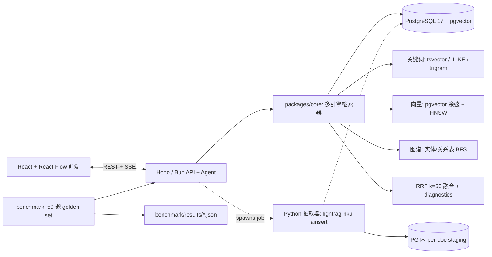

> 🌐 **语言 / Language:** [中文版](https://github.com/zt5rice/graphatlas/blob/main/PLAN-cn.md) | [English](https://github.com/zt5rice/graphatlas/blob/main/PLAN.md)

# GraphAtlas — 多引擎 GraphRAG 企业知识平台

**一周开发计划**

作者：zhaotang | 日期：2026-08-14 | 状态：决策完备（实现者无需再做任何选择）

---

## 0. 执行摘要

构建 **GraphAtlas**：一个面向"虚构公司组织知识"（组织架构、团队/项目、客户/供应商、runbook）
的端到端 GraphRAG 知识平台。它：

1. 摄取 markdown/txt/CSV 文档，并通过 LLM 实体/关系抽取（使用 `lightrag-hku` 作为抽取引擎）构建知识图谱。
2. 运行**自研多引擎检索器**：融合三条独立召回路径——关键词（PostgreSQL `tsvector`/trigram）、
   稠密向量（pgvector）、图遍历（对关系表做 BFS）——使用 Reciprocal Rank Fusion（RRF）。
3. 通过**自研工具调用 Agent**（不用 LangChain）回答问题，并给出 chunk 级引用，
   对外暴露类型化的 **Hono/TypeScript（Bun）** API 与 SSE 流式接口。
4. 提供 React（Vite + Tailwind + React Flow）前端：上传/任务、图谱浏览器、带证据的流式问答、评测看板。
5. 内置 **50 题评测基准**（自建语料 + golden set + LLM-as-judge），所有数字由用户自己的脚本实测后
   填入 README——不预设任何性能/准确率数字。

与两个常见参考实现的定位区别，这是**一条聚焦的 GraphRAG 链路 + 原创的检索/Agent/评测核心**，
既不是三链路平台（`参考实现`）的复刻，也不是垂直 LangExtract 演示（案例13）的复制；
同时刻意避开 NL2SQL 项目（FastAPI/LangChain/ECharts）的技术栈，让两条简历条目互不重叠。

---

## 1. 决策

### 1.1 项目命名

- **GraphAtlas**（仓库 `graphatlas`；本地目录 `knowledgeRAG` 可在首次推送前改名为 `graphatlas`，或保留——
  决策：改名为 `graphatlas`）。
- 简历条目：*"GraphRAG & Multi-Engine Enterprise Knowledge Platform"*。

### 1.2 技术栈（最终版）

| 层 | 选择 | 理由 |
|---|---|---|
| 平台 API + Agent | **Hono + TypeScript on Bun** | 与 NL2SQL（FastAPI/LangChain）去重；Bun/Hono 作为平台 API 运行时 |
| 图谱抽取引擎 | **Python 3.11 + `lightrag-hku`（锁定 1.5.0）**，作为轻量 CLI/侧车 | 锁定 `lightrag-hku==1.5.0`；`ainsert` 公共 API 稳定 |
| 数据库 | **PostgreSQL 17 + pgvector**（docker-compose `pgvector/pgvector:pg17` 单库） | 一个事务库同时承载向量+关键词+图谱+元数据；pgvector 是已确认蓝本 |
| 关键词检索 | **PostgreSQL `tsvector`（simple 配置）+ `ILIKE` 字面量 + 可选 `pg_trgm` GIN** | 与 PostgreSQL 关键词检索机制一致 |
| 图存储 | **自建关系表 `entities`/`relations` + 自研 SQL/BFS 遍历** | 完全可控、可测试，避免 Apache AGE 的重型编译；AGE 为可选延伸（§7.6） |
| Embedding | **OpenAI 兼容端点；默认 `text-embedding-3-small`，维度 1536**（env 可配） | 供应商无关方案（OpenRouter/DashScope 等 OpenAI 兼容端点）；维度须与 `vector(n)` 一致 |
| LLM | **OpenAI 兼容聊天端点；默认 `deepseek-chat`**（env 可配） | 用户已有 key；`AGENT_*` env 可配 |
| Agent 框架 | **无（自研工具循环）** | 与 NL2SQL 的 LangChain 去重；作为原创工作更可辩护 |
| 前端 | **React 18 + Vite + Tailwind + React Flow（`@xyflow/react`）** | 图可视化与 NL2SQL 的 ECharts 区分；评测图表用 CSS 条形/表格（不引图表库） |
| 测试 | **Bun test**（TS 单测/集成）、**pytest**（抽取器）、**Playwright**（e2e） | Playwright 作为 E2E 测试框架 |
| 基础设施 | docker-compose（PG+pgvector）、`bun run` 脚本、`.env.example` | 本地开发可复现 |

**刻意排除**（去重/控范围）：FastAPI、LangChain/LangGraph、SQLite/SQLAlchemy、ECharts、
Qdrant/ChromaDB、Next.js、MCP Server、Apache AGE（仅作可选延伸）。

### 1.3 架构



构建期 staging 与运行期索引的分工：抽取器先把每篇文档的图谱产物写入 per-document LightRAG staging
工作区，再通过 ETL 把 chunk/entity/relation 行（含 embedding）拷贝进稳定的运行期 schema
（`chunks`/`entities`/`relations`），检索器与 Agent 只读这套运行期表。这样检索只有单一事实来源，
也便于添加关键词/trigram 索引与治理字段，而不用去适配 LightRAG 内部表命名。

---

## 2. 核心功能与模块拆分

### 2.1 模块地图

```
graphatlas/
├── apps/
│   ├── api/            Hono+Bun：REST + SSE（documents、jobs、search、chat、graph、entities、facts、eval、health）
│   │   └── src/agent/  自研工具循环：tools、prompts、stream
│   └── web/            React+Vite+Tailwind+React Flow：上传/任务、图谱浏览器、问答、评测看板
├── packages/
│   ├── core/           TS 库：关键词/向量/图召回、RRF、mode router、BFS、snippet
│   ├── db/             迁移 + 查询构建 + ETL 辅助
│   └── contracts/      共享 TS 类型
├── extractor/          Python 3.11 + lightrag-hku：ainsert staging → ETL 到运行期 schema
├── data/
│   ├── corpus/         10–15 篇英文组织文档（md/txt/csv）
│   └── eval/           golden_questions.json（50 题）
├── benchmark/          run.ts + judge.ts + results/
├── tests/              unit/ integration/ e2e/
├── scripts/            setup.sh、demo.sh、e2e.sh
├── docs/               ARCHITECTURE.md、API.md、BENCHMARK.md、EMBEDDING.md
├── docker-compose.yml  postgres:17 + pgvector
└── .env.example
```

### 2.2 管线阶段（功能清单）

1. **数据摄取**（`POST /api/v1/documents` + `POST /documents/:id/ingest` → 异步 job）
   - 接收 md/txt/csv；保存原始文件；写入 `documents` + `jobs` 行。
   - 阶段 1（抽取器）：对每篇文档 `lightrag-hku.ainsert` 写入 staging 工作区
     （chunk_token_size=512、overlap=64、embedding 维度取 env）。
   - 阶段 2（ETL，TS）：chunks → `chunks`（补 `text_search` 生成 tsvector + embedding）；
     entities/relations → `entities`/`relations`（按 LightRAG 文本格式 embed：
     `name\ndescription` 与 `keyword\tsrc\ntgt\n\ndescription`）；映射 `source_chunk_ids`。
   - 阶段 3：收尾 job（状态 `ready`、记录耗时）；staging 清理可选。
2. **图构建**：完全委托 LightRAG 抽取（有出处）——用户**不**重写 LLM 抽取/merge；
   用户实现 ETL、索引与全部检索。
3. **多引擎检索**（`POST /api/v1/search`）——用户自研代码：
   - 关键词路：`plainto_tsquery('simple', q)` + `ts_rank`（`chunks.text_search`）；
     字面量路：`ILIKE` 短语 + 紧凑无空格变体（实体/关系名也参与）；可选 `pg_trgm` 相似度容错。
   - 向量路：query embedding → chunks/entities/relations 余弦（`<=>`，各取 top-k）。
   - 图路：seed 实体（query 提及 + 向量命中）→ `relations` 上 1–2 跳 BFS（防环，`MAX_HOP=2`）→
     收集边、邻居实体及其 chunk。
   - 融合：RRF `K=60`、逐候选 `rank_details` + `match_types`、归一化分数、逐路径 `diagnostics`
     （对齐业界混合检索设计，自研实现）。
   - Mode 路由：`auto` → 规则关键词（关系/邻域→local；格局/主题→global；都有→mix）→ LLM 兜底 → 默认 `mix`。
4. **QA Agent**（`POST /api/v1/chat`，SSE）——用户自研循环：
   - 工具：`search_hybrid`、`graph_neighbors`、`get_document`、`lookup_entity`。
   - 最多 4 轮工具调用；答案必须引用 `chunk_id`；流式事件
     `session/tool_call/evidence/delta/done`；输出 trace 供 UI 渲染。
5. **治理（P2）**：实体编辑/删除/合并接口；`facts` 人工审批流（nano-Gbrain 启发）——
    仅在 Day 4/5 时间允许时做（§9 默认：有时间就做）。
6. **Benchmark 与评测看板**（P1，§5.4）。
7. **前端**：上传与任务状态；图谱浏览器（React Flow，点击 1 跳展开、类型配色、权重分层）；带证据卡片的
   问答；评测看板。

---

## 3. 公共 API 与数据模型

### 3.1 接口（Hono，base `/api/v1`）

| 方法与路径 | 请求 → 响应 | 备注 |
|---|---|---|
| `POST /documents` | multipart(file, title, kind) → `{id}` | kind ∈ md/txt/csv |
| `GET /documents` / `GET /documents/:id` | → 列表 / 详情 | |
| `POST /documents/:id/ingest` | → `{job_id}` | 异步 |
| `GET /jobs/:id` | → `{status, stage, error, timings}` | |
| `POST /search` | `{query, mode?, top_k?}` → `{results[], diagnostics[], fusion}` | top_k ≤ 30 |
| `POST /chat` | SSE：`{query, history?}` → 事件 | |
| `GET /graph/nodes?q=` / `POST /graph/neighbors` | `{entity_id, depth}` → `{nodes[], edges[]}` | React Flow 格式 |
| `GET /entities?q=&type=` / `PATCH\|DELETE /entities/:id` / `POST /entities/merge` | admin token | P2 |
| `GET/POST /facts`、`POST /facts/:id/review` | `{action: approve\|reject}` | P2 |
| `POST /eval/run`、`GET /eval/runs/:id` | `{mode?}` → `{metrics, per_question}` | benchmark |
| `GET /health` | → `{db, extractor, embedding, llm}` | |

认证：写/管理路由用单一 `API_TOKEN`（env）；读路由开放（本地工具）。无多租户。

### 3.2 运行期 schema（PostgreSQL，schema `graphatlas`）

```sql
documents(id uuid pk, title text, kind text, status text, -- uploaded|processing|ready|failed
          file_type text, metadata jsonb, created_at timestamptz, updated_at timestamptz);

chunks(id text pk,             -- = LightRAG staging chunk id（稳定链接）
       document_id uuid fk, chunk_index int, text text,
       text_search tsvector GENERATED ALWAYS AS (to_tsvector('simple', text)) STORED,
       embedding vector(1536), embedding_model text, embedding_dim int,
       UNIQUE(document_id, chunk_index));
-- 索引：GIN(text_search)、GIN(text gin_trgm_ops) [可选]、HNSW(embedding vector_cosine_ops)

entities(id text pk, name text, entity_type text, description text,
         source_chunk_ids jsonb, embedding vector(1536), created_at timestamptz);
-- 索引：HNSW(embedding)、btree(name)、GIN(source_chunk_ids)

relations(id text pk, src_id text fk entities, tgt_id text fk entities,
          keywords text, description text, weight float, source_chunk_ids jsonb,
          UNIQUE(src_id, tgt_id));
-- 索引：HNSW(embedding)、btree(src_id)、btree(tgt_id)

jobs(id text pk, document_id fk, status text, stage text, error jsonb, timings jsonb,
     created_at timestamptz, updated_at timestamptz);

facts(id text pk, content text, status text, -- pending|approved|rejected
      source_chunk_id text, submitted_by text, reviewed_by text, reviewed_at timestamptz);  -- P2

eval_runs(id text pk, mode text, started_at timestamptz, finished_at timestamptz,
          metrics jsonb, per_question jsonb);
```

维度说明：`vector(1536)` 是 `text-embedding-3-small` 的默认维度；若更换 embedding 模型，需更新
`EMBEDDING_DIMENSIONS` 并重新生成迁移（见 `docs/API.md` 与 `docs/EMBEDDING.md`）。
向量维度必须等于 LightRAG 配置的 embedding 维度。

---

## 4. 测试与验收

### 4.1 单元测试（Bun test / pytest）——不依赖 DB 或网络
- 切块对齐辅助、RRF 数学（`K=60`、并列、归一化）、mode router 规则、BFS（防环、MAX_HOP=2、去重）、
  snippet 生成、ETL 行映射。
- 抽取器：env 校验、staging→runtime 映射函数（pytest，mock）。

### 4.2 集成测试（对一次性 PG+pgvector 库）
- 摄取 2–3 篇 fixture 文档 → 断言 chunk/entity/relation 计数 > 0、实体去重、chunk 对齐
  （LightRAG chunk id 与运行期 chunks 1:1）、embedding/tsvector 已填充。
- 检索：对已知查询，每条路径返回预期证据；过滤（`source_id`、`top_k`）。
- 聊天：对已知多跳问题，工具调用返回引用。

### 4.3 端到端（Playwright + 脚本）
- 场景 A：上传 → 摄取 → job ready → 图谱浏览器显示实体/边。
- 场景 B：提多跳问题 → SSE 完成 → 答案含 ≥1 个引用 chunk id → 证据卡片打开原文。
- 场景 C：用 5 题 smoke 子集跑 benchmark。

### 4.4 Benchmark 设计（"数字"的唯一来源——不预设数字）

**语料与 golden set（`data/eval/golden_questions.json`，50 题，英文）：**
- 15 道单跳事实题（如 "Who is the CTO of Acme?"）
- 15 道多跳关系题（如 "Who does the person managing Project Atlas report to?"）
- 10 道全局/聚合题（如 "Which teams own more than two active projects?"）
- 10 道困难/负例（跨文档组合、近似重名、范围外问题）
- 每条：`{id, question, category, expected_entities[], expected_relations[],
  expected_chunk_ids[], golden_answer, notes}`。

**指标（精确定义）：**
- `EntityRecall@10` = 50 题平均：|检索到实体 ∩ 预期实体| / |预期实体|
- `RelationRecall@10` = 关系同上
- `ChunkRecall@10` = top-10 融合证据中出现预期 chunk id 的比例
- `Hit@1` / `Hit@5` = 仅用 top-1 / top-5 证据时 LLM-judge 的二值正确率
- `Faithfulness` = LLM-judge 1–5 均值：答案句子中可归因到引用 chunk 的比例
- `p50/p95` 延迟（检索；聊天首 token；聊天总时长）、每次查询 token 与估算成本
- 摄取成本：每篇文档的抽取 token 与墙钟耗时

**消融矩阵（同一 50 题、同一 judge）：**
`vector-only` vs `keyword-only` vs `graph-only` vs `hybrid-rrf`。每次运行输出 JSON 到
`benchmark/results/<date>-<mode>.json`；`--summary` 命令渲染 README 数字表（实测增量，如
"hybrid vs vector-only: +X% Hit@5"）。**规则：简历或 README 上的任何数字必须能溯源到
`benchmark/results/` 下的 JSON 文件。**

**Judge 卫生：** 固定 judge prompt、temperature 0、确定性模型、每个结果 JSON 记录 judge 模型 +
语料 git hash；人工抽查 10/50 题。

---

## 5. 五个里程碑（5 Milestones，Day 1–5）

| 天 | 工作 | 门禁（完成定义） |
|---|---|---|
| **1** | 搭建 Bun workspaces + Vite app + docker-compose（PG17+pgvector）+ `.env.example` + git init。写完整运行期迁移（表、tsvector、HNSW）。上传 API + job 骨架。写语料（10–15 篇英文文档）+ golden set 草稿（50 题）。 | `bun run db:init` 干净；上传 API 返回 job；语料 + golden 草稿已提交 |
| **2** | 抽取器包（lightrag-hku `ainsert` staging → ETL 到运行期 schema，embedding + tsvector 回填）。fixture 集成测试。定稿语料 + golden set。锁定 LightRAG staging 表名。 | 抽取器 CLI 摄取整个语料；集成测试断言计数/对齐；golden set 定稿（50） |
| **3** | 在 `packages/core` 实现检索引擎：关键词/向量/图召回 + RRF + mode router + diagnostics；`/search` 接口。单元 + 集成测试。Benchmark runner v1（指标、JSON 输出）。 | `/search` 返回带 `match_types` + `diagnostics` 的证据；bench runner 产出合法 JSON |
| **4** | Agent 循环 + SSE `/chat`（带工具与引用要求）。前端：上传/任务、图谱浏览器（React Flow）、带证据的问答、评测看板。E2E 脚本。 | 聊天流式返回并引用 chunk；e2e 场景 A–C 通过 |
| **5** | 跑 benchmark（4 模式 × 50 题，LLM-judge），把真实数字填入 `README.md` + `docs/BENCHMARK.md`（只有跑挂时才用占位符）。打磨 README（mermaid 架构、快速开始、演示视频位、技术词→代码映射）、`docs/API.md`。录 5–8 分钟演示视频。最终全量测试通过，推 GitHub，打 `v1.0` tag。 | README 数字全部可溯源 `benchmark/results/*.json`；测试全绿；仓库公开 |

应急预案：Day 2 若超时，砍掉可选 `pg_trgm`，保留 tsvector+ILIKE；Day 4 若超时，砍掉 facts 模块（P2）——
P1 范围（摄取 → 建图 → 混合检索 → Agent → 评测 → 前端）不可砍。

---

## 6. 假设与默认值（显式声明）

1. 本地 macOS 开发；有 Docker Desktop；可访问 OpenAI 兼容 LLM/embedding 端点（DeepSeek key 已在用；
   embedding 走 OpenAI 兼容端点，默认 `text-embedding-3-small`，维度 1536）。
2. 语料为**用户自写英文组织文档**（无版权问题；贴合美国求职）。
3. "Multi-Engine" = 检索引擎（关键词 + 向量 + 图谱），不是多条管线链路；**不**重做 nano-Gbrain 的 wiki 链路
   （只借鉴其人工审批 `facts` 思想，P2）。
4. 单用户本地平台、单一 admin token；无多租户、无会话持久化（聊天历史随请求传入；前端内存保存）。
5. LightRAG 仅用于 LLM 抽取 + staging；**本仓库内所有检索、融合、Agent、评测均为自研**。
6. 数字只实测；"5x"、">80%" 等一律不预设——README 展示 "Measured results" 表，用 `+X%` 占位直到有 benchmark JSON。
7. 默认值：`chunk_token_size=512`、`overlap=64`、`RRF_K=60`、`MAX_HOP=2`、`top_k≤30`、
   `candidate_limit=max(top_k*5, 50)`。

---

## 7. 开放 / 可选事项

- 8.1 Apache AGE（Cypher 图存储）：**可选延伸**，仅当 Day 5 提前绿灯时做。未真正实现并测试前，
  不写入简历。
- 8.2 抽取器/检索器的 MCP Server：**排除**（超范围）。
- 8.3 用自研 chunker 替代 LightRAG 切块：**排除**（LightRAG 切块保持单一事实来源）；记为未来工作。
- 8.4 Facts 治理（nano-Gbrain 启发）：P2，时间允许则做（§9 默认）。

---

## 8. 简历与 README 内容

### 8.1 简历可直接引用的描述（1–2 句，英文）

> **GraphRAG & Multi-Engine Enterprise Knowledge Platform** — built end-to-end a knowledge
> platform that ingests organizational documents, constructs a knowledge graph via LLM
> entity/relation extraction (LightRAG), and answers questions through a hand-written hybrid
> retriever fusing PostgreSQL keyword (tsvector/trigram), dense vector (pgvector), and graph
> traversal with Reciprocal Rank Fusion, behind a typed Hono/TypeScript API and a React graph
> explorer. Also built a 50-question benchmark harness with LLM-as-judge scoring; measured
> hybrid fusion to improve answer hit rate by **+X%** and recall by **+Y%** over vector-only
> retrieval (X, Y from my own benchmark runs, results in repo).

### 8.2 README 要点
- Mermaid 架构图（§1.3）+ 一次查询的数据流。
- 快速开始（`cp .env.example .env` → `docker compose up -d` → `bun run db:init` →
  `bun run dev:all` → seed 语料）。
- **演示视频位**（`docs/demo.mp4`，5–8 分钟：上传 → 图谱浏览器 → 带证据的混合问答 → 评测看板）。
- **实测结果表**（仅从 `benchmark/results/*.json` 填充）：Hit@1/5、Recall@10、Faithfulness、
  p50/p95 延迟、每次查询成本、消融增量。
- **技术词 → 代码诚实映射**（每个简历词指向一个文件）：
  `pgvector` → `packages/db/migrations/*.sql`；`RRF` → `packages/core/retrieval/rrf.ts`；
  `LightRAG` → `extractor/src/.../extract.py`；`tsvector/pg_trgm` → migrations + `keyword.ts`；
  图 BFS → `packages/core/retrieval/graph.ts`；Agent → `参考项目的统一 API/src/agent/*.ts`；
  benchmark → `benchmark/run.ts` + `data/eval/golden_questions.json`。

---

## 9. 需要用户确认的决策点（推荐默认值已给出）

本计划在推荐默认值下已决策完备，实现者可立即开工。以下三个问题的答案只会调整标注区域：

1. **后端语言** —— 推荐：**Hono + TypeScript（Bun）**（证据确凿；与 NL2SQL 的 FastAPI 去重；
   Python 仅作 LightRAG 抽取侧车）。备选：全 Python + FastAPI（更贴近单一语言实现，但重复 NL2SQL 技术栈）。
2. **`tsvector` / `pg_trgm`** —— 推荐：**纳入**（PostgreSQL 迁移实践中有确凿证据；
   强化关键词路径并区别于 NL2SQL）。备选：按原始假设排除。
3. **语料与领域** —— 推荐：**用户自写英文企业组织知识语料**（组织架构、项目、客户、runbook，
   10–15 篇 + 50 道英文题）。备选：中文语料，或公开数据集（如 Wikipedia 子集）。
