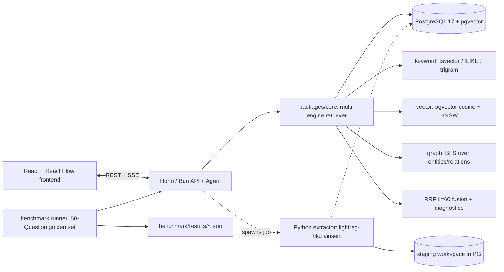

> 🌐 **Language / 语言:** [English](https://github.com/zt5rice/graphatlas/blob/main/PLAN.md) | [中文版](https://github.com/zt5rice/graphatlas/blob/main/PLAN-cn.md)

# GraphAtlas — Multi-Engine GraphRAG Enterprise Knowledge Platform

**Development Plan (Week 1)**

Author: zhaotang | Date: 2026-08-14 | Status: decision-complete (implementer makes no further choices)

---

## 0. Executive Summary

Build **GraphAtlas**, an end-to-end GraphRAG knowledge platform for a fictional company's
organizational knowledge (org chart, teams/projects, customers/vendors, runbooks). It:

1. Ingests markdown/txt/CSV documents and builds a knowledge graph via LLM entity/relation
   extraction (using `lightrag-hku` as the extraction engine).
2. Runs a **hand-written multi-engine retriever** that fuses three independent recall paths —
   keyword (PostgreSQL `tsvector`/trigram), dense vector (pgvector), and graph traversal
   (BFS over relational entity/relation tables) — with Reciprocal Rank Fusion (RRF).
3. Answers questions through a **hand-written tool-calling agent** (no LangChain) with
   chunk-level citations, exposed over a typed **Hono/TypeScript (Bun)** API with SSE streaming.
4. Ships a React (Vite + Tailwind + React Flow) frontend: upload/jobs, graph explorer,
   streaming QA with evidence, and a benchmark dashboard.
5. Includes a **50-question benchmark harness** (own corpus + golden set + LLM-as-judge)
   whose numbers are measured by the user's own scripts and then filled into the README —
   no preset performance/accuracy figures.

Positioning vs. two common reference implementations: this is **one focused GraphRAG chain with
an original retrieval/agent/eval core**, not a copy of the 3-pipeline platform
(`a reference implementation`) and not the vertical LangExtract demo (case 13). It also deliberately
avoids the NL2SQL project's stack (FastAPI/LangChain/ECharts) to keep the two resume entries
non-overlapping.

---

## 1. Decisions

### 1.1 Project name

- **GraphAtlas** (repo `graphatlas`; the local folder `knowledgeRAG` can be renamed to
  `graphatlas` before the first push, or kept — decide: rename to `graphatlas`).
- Resume line: *"GraphRAG & Multi-Engine Enterprise Knowledge Platform"*.

### 1.2 Tech stack (final)

| Layer | Choice | Why  |
|---|---|---|
| Platform API + Agent | **Hono + TypeScript on Bun** | Distinct from NL2SQL (FastAPI/LangChain); Bun/Hono as the platform API runtime |
| Graph extraction engine | **Python 3.11 + `lightrag-hku` (pinned 1.5.0)** as a thin CLI/sidecar | Course pins `lightrag-hku==1.5.0`; robust public `ainsert` API |
| Database | **PostgreSQL 17 + pgvector** (single DB via docker-compose `pgvector/pgvector:pg17`) | One transactional store for vector + keyword + graph + metadata; pgvector is a confirmed blueprint |
| Keyword search | **PostgreSQL `tsvector` (simple config) + `ILIKE` literal + optional `pg_trgm` GIN** | Exact mechanism in PostgreSQL keyword-search practice |
| Graph storage | **Own relational tables `entities`/`relations` + hand-written SQL/BFS traversal** | Full control, testable, no heavy Apache AGE build; AGE is an optional stretch (§7.6) |
| Embeddings | **OpenAI-compatible endpoint; default `text-embedding-3-small`, dim 1536** (env-configurable) | Provider-agnostic (OpenRouter/DashScope and other OpenAI-compatible endpoints); dim must match `vector(n)` |
| LLM | **OpenAI-compatible chat endpoint; default `deepseek-chat`** (env-configurable) | User already has keys; `AGENT_*` env-configurable |
| Agent framework | **None (hand-written tool loop)** | Dedup vs NL2SQL LangChain; more defensible as original work |
| Frontend | **React 18 + Vite + Tailwind + React Flow (`@xyflow/react`)** | Graph visualization distinct from NL2SQL's ECharts; no chart lib for eval (CSS bars/tables) |
| Tests | **Bun test** (TS unit/integration), **pytest** (extractor), **Playwright** (e2e) | Playwright as the E2E test framework |
| Infra | docker-compose (PG+pgvector), `bun run` scripts, `.env.example` | Reproducible local dev |

Deliberately **excluded** (dedup / scope): FastAPI, LangChain/LangGraph, SQLite/SQLAlchemy,
ECharts, Qdrant/ChromaDB, Next.js, MCP servers, Apache AGE (optional stretch only).

### 1.3 Architecture



Build-time staging vs. runtime index: the extractor writes each document's graph products into
a per-document LightRAG staging workspace, then an ETL copies chunk/entity/relation rows (plus
embeddings) into the stable runtime schema (`chunks`, `entities`, `relations`) that the
retriever and agent read. This keeps one source of truth for retrieval and lets us add
keyword/trigram indexes and curation fields without fighting LightRAG's internal table naming.

---

## 2. Core Features & Module Split

### 2.1 Module map

```
graphatlas/
├── apps/
│   ├── api/            Hono+Bun: REST + SSE (documents, jobs, search, chat, graph, entities, facts, eval, health)
│   │   └── src/agent/  hand-written tool loop: tools, prompts, stream
│   └── web/            React+Vite+Tailwind+React Flow: Upload/Jobs, Graph Explorer, QA Chat, Eval Dashboard
├── packages/
│   ├── core/           TS library: chunk-keyword/vector/graph recall, RRF, mode router, BFS, snippet
│   ├── db/             migrations + query builders + ETL helpers
│   └── contracts/      shared TS types
├── extractor/          Python 3.11 + lightrag-hku: ainsert staging → ETL to runtime schema
├── data/
│   ├── corpus/         10–15 English org docs (md/txt/csv)
│   └── eval/           golden_questions.json (50)
├── benchmark/          run.ts + judge.ts + results/
├── tests/              unit/ integration/ e2e/
├── scripts/            setup.sh, demo.sh, e2e.sh
├── docs/               ARCHITECTURE.md, API.md, BENCHMARK.md
├── docker-compose.yml  postgres:17 + pgvector
└── .env.example
```

### 2.2 Pipeline stages (feature list)

1. **Ingestion** (`POST /api/v1/documents` + `POST /documents/:id/ingest` → async job)
   - Accept md/txt/csv; store raw file; create `documents` + `jobs` rows.
   - Stage 1 (extractor): `lightrag-hku.ainsert` per document into staging workspace
     (chunk_token_size=512, overlap=64, embedding dim from env).
   - Stage 2 (ETL, TS): copy chunks → `chunks` (add `text_search` generated tsvector +
     embedding); copy entities/relations → `entities`/`relations` (embed `name\ndescription`
     and `keyword\tsrc\ntgt\n\ndescription`, same text formats as LightRAG );
     map `source_chunk_ids`.
   - Stage 3: finalize job (status `ready`, timings recorded); staging cleanup optional.
2. **Graph construction**: fully delegated to LightRAG extraction (cited) — user does NOT
   reimplement LLM extraction/merge; user implements the ETL, indexing, and all retrieval.
3. **Multi-engine retrieval** (`POST /api/v1/search`) — user's own code:
   - Keyword path: `plainto_tsquery('simple', q)` + `ts_rank` on `chunks.text_search`;
     literal path: `ILIKE` phrase + compact-CJK-style no-space variant (entities/relations
     names too); optional `pg_trgm` similarity for typo tolerance.
   - Vector path: embed query → cosine `<=>` on chunks + entities + relations (top-k each).
   - Graph path: seed entities (query-mention + top vector hits) → BFS 1–2 hops over
     `relations` (cycle-safe, `MAX_HOP=2`) → collect edges, neighbor entities, their chunks.
   - Fusion: RRF with `K=60`, per-candidate `rank_details` + `match_types`, normalized scores,
     `diagnostics` per path (own implementation of hybrid retrieval).
   - Mode router: `auto` → rule keywords (relationship/neighborhood → local; overview/theme →
     global; both → mix) → LLM fallback → default `mix` (own simplified version).
4. **QA agent** (`POST /api/v1/chat`, SSE) — user's own loop:
   - Tools: `search_hybrid`, `graph_neighbors`, `get_document`, `lookup_entity`.
   - Max 4 tool iterations; every answer must cite `chunk_id`s; stream
     `session/tool_call/evidence/delta/done` events; emit a trace the UI renders.
5. **Governance (P2)**: entity edit/delete/merge endpoints; `facts` human-approval flow
   (nano-Gbrain-inspired) — only if Day-4/5 time allows (§9 default: include if time).
6. **Benchmark & eval dashboard** (P1, §5.4).
7. **Frontend**: upload & job status; graph explorer (React Flow, click → 1-hop expand,
   type colors, weight layering); QA chat with evidence cards + tool trace; eval dashboard.

---

## 3. Public API & Data Model

### 3.1 Endpoints (Hono, base `/api/v1`)

| Method & path | Request → Response | Notes |
|---|---|---|
| `POST /documents` | multipart(file, title, kind) → `{id}` | kind ∈ md/txt/csv |
| `GET /documents` / `GET /documents/:id` | → list / detail | |
| `POST /documents/:id/ingest` | → `{job_id}` | async |
| `GET /jobs/:id` | → `{status, stage, error, timings}` | |
| `POST /search` | `{query, mode?, top_k?}` → `{results[], diagnostics[], fusion}` | top_k ≤ 30 |
| `POST /chat` | SSE: `{query, history?}` → events | |
| `GET /graph/nodes?q=` / `POST /graph/neighbors` | `{entity_id, depth}` → `{nodes[], edges[]}` | React Flow format |
| `GET /entities?q=&type=` / `PATCH|DELETE /entities/:id` / `POST /entities/merge` | admin token | P2 |
| `GET/POST /facts` , `POST /facts/:id/review` | `{action: approve\|reject}` | P2 |
| `POST /eval/run` , `GET /eval/runs/:id` | `{mode?}` → `{metrics, per_question}` | benchmark |
| `GET /health` | → `{db, extractor, embedding, llm}` | |

Auth: single `API_TOKEN` (env) for write/admin routes; reads open (local tool). No multi-tenant.

### 3.2 Runtime schema (PostgreSQL, schema `graphatlas`)

```sql
documents(id uuid pk, title text, kind text, status text, -- uploaded|processing|ready|failed
          file_type text, metadata jsonb, created_at timestamptz, updated_at timestamptz);

chunks(id text pk,             -- = LightRAG staging chunk id (stable link)
       document_id uuid fk, chunk_index int, text text,
       text_search tsvector GENERATED ALWAYS AS (to_tsvector('simple', text)) STORED,
       embedding vector(1536), embedding_model text, embedding_dim int,
       UNIQUE(document_id, chunk_index));
-- indexes: GIN(text_search), GIN(text gin_trgm_ops) [optional], HNSW(embedding vector_cosine_ops)

entities(id text pk, name text, entity_type text, description text,
         source_chunk_ids jsonb, embedding vector(1536), created_at timestamptz);
-- index: HNSW(embedding), btree(name), GIN(source_chunk_ids)

relations(id text pk, src_id text fk entities, tgt_id text fk entities,
          keywords text, description text, weight float, source_chunk_ids jsonb,
          UNIQUE(src_id, tgt_id));
-- indexes: HNSW(embedding), btree(src_id), btree(tgt_id)

jobs(id text pk, document_id fk, status text, stage text, error jsonb, timings jsonb,
     created_at timestamptz, updated_at timestamptz);

facts(id text pk, content text, status text, -- pending|approved|rejected
      source_chunk_id text, submitted_by text, reviewed_by text, reviewed_at timestamptz);  -- P2

eval_runs(id text pk, mode text, started_at timestamptz, finished_at timestamptz,
          metrics jsonb, per_question jsonb);
```

Dimension note: `vector(1536)` is the default for `text-embedding-3-small`; if the embedding
model changes, update `EMBEDDING_DIMENSIONS` and regenerate migrations (documented in
`docs/API.md`). The vector dimension must equal LightRAG's configured embedding dim.

---

## 4. Testing & Acceptance

### 4.1 Unit tests (Bun test / pytest) — no DB or network
- Chunker alignment helper, RRF math (`K=60`, tie-break, normalization), mode-router rules,
  BFS (cycle safety, MAX_HOP=2, dedupe), snippet generation, ETL row mapping.
- Extractor: env validation, staging→runtime mapping functions (pytest, mocked).

### 4.2 Integration tests (against a throwaway PG+pgvector database)
- Ingest 2–3 fixture docs → assert chunk/entity/relation counts > 0, entity dedupe, chunk
  alignment (LightRAG chunk ids map 1:1 to runtime chunks), embeddings/tsvector populated.
- Search: each path returns expected evidence for a known query; filters (`source_id`, `top_k`).
- Chat: tool-calling returns citations for a known multi-hop question.

### 4.3 End-to-end (Playwright + script)
- Scenario A: upload → ingest → job ready → graph explorer shows entities/edges.
- Scenario B: ask a multi-hop question → SSE completes → answer contains ≥1 cited chunk id →
  evidence card opens the source text.
- Scenario C: run benchmark on a 5-question smoke subset.

### 4.4 Benchmark design (the "numbers" source — no preset figures)

**Corpus & golden set (`data/eval/golden_questions.json`, 50 questions, English):**
- 15 single-hop fact (e.g., "Who is the CTO of Acme?")
- 15 multi-hop relation (e.g., "Who does the person managing Project Atlas report to?")
- 10 global/aggregation (e.g., "Which teams own more than two active projects?")
- 10 negative/hard (cross-doc combination, near-duplicate names, out-of-scope)
- Each item: `{id, question, category, expected_entities[], expected_relations[],
  expected_chunk_ids[], golden_answer, notes}`.

**Metrics (exact definitions):**
- `EntityRecall@10` = avg over 50 of |retrieved entities ∩ expected_entities| / |expected_entities|
- `RelationRecall@10` = same for relations
- `ChunkRecall@10` = same for expected chunk ids present in top-10 fused evidence
- `Hit@1` / `Hit@5` = LLM-judge binary correctness using only top-1 / top-5 evidence
- `Faithfulness` = LLM-judge 1–5 mean: fraction of answer sentences attributable to cited chunks
- `p50/p95` latency (search; chat first-token; chat total), tokens + estimated cost per query
- Ingest cost: extraction tokens + wall time per document

**Ablation matrix (same 50 questions, same judge):**
`vector-only` vs `keyword-only` vs `graph-only` vs `hybrid-rrf`. Output JSON per run to
`benchmark/results/<date>-<mode>.json`; a `--summary` command renders the README table with
measured deltas (e.g., "hybrid vs vector-only: +X% Hit@5"). **Rule: any number on the resume
or README must trace to a JSON file in `benchmark/results/`.**

**Judge hygiene:** fixed judge prompt, temperature 0, deterministic model, record judge model +
corpus git hash in each result JSON; human spot-check 10/50 questions.

---

## 5. Five Milestones (Day 1–5)

| Day | Work | Gate (definition of done) |
|---|---|---|
| **1** | Scaffold Bun workspaces + Vite app + docker-compose (PG17+pgvector) + `.env.example` + git init. Write full runtime migrations (tables, tsvector, HNSW). Upload API + job skeleton. Write corpus (10–15 English docs) + draft golden set (50 Qs). | `bun run db:init` clean; upload API returns a job; corpus + golden draft committed |
| **2** | Extractor package (lightrag-hku `ainsert` staging → ETL to runtime schema, embeddings + tsvector backfill). Integration test on fixtures. Finalize corpus + golden set. Pin LightRAG staging table names. | Extractor CLI ingests the corpus; integration test asserts counts/alignment; golden set final (50) |
| **3** | Retrieval engine in `packages/core`: keyword/vector/graph recall + RRF + mode router + diagnostics; `/search` endpoint. Unit + integration tests. Benchmark runner v1 (metrics, JSON output). | `/search` returns evidence with `match_types` + `diagnostics`; bench runner produces valid JSON |
| **4** | Agent loop + SSE `/chat` with tools + citation requirement. Frontend: Upload/Jobs, Graph Explorer (React Flow), QA chat with evidence, Eval dashboard. E2E script. | Chat streams and cites chunks; e2e scenarios A–C pass |
| **5** | Run benchmark (4 modes × 50 Qs, LLM-judge), fill real numbers into `README.md` + `docs/BENCHMARK.md` (placeholders only if a run fails). Polish README (mermaid architecture, quick start, demo-video slot, tech→code honesty map), `docs/API.md`. Record 5–8 min demo video. Final full test pass, push to GitHub, tag `v1.0`. | README numbers all trace to `benchmark/results/*.json`; tests green; repo public |

Contingency: if Day 2 slips, drop optional `pg_trgm` and keep tsvector+ILIKE; if Day 4 slips,
drop facts module (P2) — the P1 scope (ingest → graph → hybrid retrieval → agent → eval →
frontend) is non-negotiable.

---

## 6. Assumptions & Defaults (explicit)

1. Local macOS dev; Docker Desktop available; network access to OpenAI-compatible
   LLM/embedding endpoints (DeepSeek key already in use; embedding via an OpenAI-compatible
   endpoint, default `text-embedding-3-small`, dim 1536).
2. Corpus is **user-authored English** org docs (no copyright issues; aligns with US resume).
3. "Multi-Engine" = retrieval engines (keyword + vector + graph), not multiple pipeline chains;
   nano-Gbrain's wiki chain is **not** re-implemented (only its human-approved `facts` idea, P2).
4. Single-user local platform, single admin token; no multi-tenant, no sessions persistence
   (chat history passed in request; frontend keeps history in memory).
5. LightRAG is used only for LLM extraction + staging; **all retrieval, fusion, agent, and eval
   are hand-written in this repo**.
6. Numbers are measured only; "5x", ">80%" etc. are never preset — README shows a
   "Measured results" table with `+X%` placeholders until benchmark JSON exists.
7. Defaults: `chunk_token_size=512`, `overlap=64`, `RRF_K=60`, `MAX_HOP=2`, `top_k≤30`,
   `candidate_limit=max(top_k*5, 50)`.

---

## 7. Open / Optional Items

- 8.1 Apache AGE (Cypher graph store): **optional stretch**, only if Day 5 is green early.
  Not claimed on the resume unless actually implemented and tested.
- 8.2 MCP server for the extractor/retriever: **excluded** (out of scope).
- 8.3 Custom chunker replacing LightRAG's: **excluded** (LightRAG chunking keeps one source
  of truth); noted as future work.
- 8.4 Facts governance (nano-Gbrain-inspired): P2, include if time (§9 default).

---

## 8. Resume & README Content

### 8.1 Resume-ready description (1–2 sentences, English)

> **GraphRAG & Multi-Engine Enterprise Knowledge Platform** — built end-to-end a knowledge
> platform that ingests organizational documents, constructs a knowledge graph via LLM
> entity/relation extraction (LightRAG), and answers questions through a hand-written hybrid
> retriever fusing PostgreSQL keyword (tsvector/trigram), dense vector (pgvector), and graph
> traversal with Reciprocal Rank Fusion, behind a typed Hono/TypeScript API and a React graph
> explorer. Also built a 50-question benchmark harness with LLM-as-judge scoring; measured
> hybrid fusion to improve answer hit rate by **+X%** and recall by **+Y%** over vector-only
> retrieval (X, Y from my own benchmark runs, results in repo).

### 8.2 README key points
- Mermaid architecture diagram (§1.3) + data-flow of one query.
- Quick start (`cp .env.example .env` → `docker compose up -d` → `bun run db:init` →
  `bun run dev:all` → seed corpus).
- **Demo video slot** (`docs/demo.mp4`, 5–8 min: upload → graph explorer → hybrid QA with
  evidence → eval dashboard).
- **Measured results table** (filled only from `benchmark/results/*.json`): Hit@1/5,
  Recall@10, Faithfulness, p50/p95 latency, cost/query, ablation deltas.
- **Tech → code honesty map** (every resume term points to a file):
  `pgvector` → `packages/db/migrations/*.sql`; `RRF` → `packages/core/retrieval/rrf.ts`;
  `LightRAG` → `extractor/src/.../extract.py`; `tsvector/pg_trgm` → migrations + `keyword.ts`;
  `graph BFS` → `packages/core/retrieval/graph.ts`; agent → `apps/api/src/agent/*.ts`;
  benchmark → `benchmark/run.ts` + `data/eval/golden_questions.json`.

---

## 9. Decision Points Requiring User Confirmation (recommended defaults shown)

The plan is complete with the recommended defaults; implementers may start immediately.
Answers to these three questions would adjust only the marked areas:

1. **Backend language** — Recommended: **Hono + TypeScript on Bun** (evidence found; dedups
   vs FastAPI in NL2SQL; Python only as the LightRAG extraction sidecar). Alternative: Python
   + FastAPI everywhere (closer to a single-language implementation but duplicates your NL2SQL stack).
2. **`tsvector` / `pg_trgm`** — Recommended: **include** (real evidence in PostgreSQL practice
   migration practice; strengthens keyword path and differentiates from NL2SQL).
   Alternative: exclude per the original brief.
3. **Corpus & domain** — Recommended: **user-authored English org-knowledge corpus** (org
   chart, projects, customers, runbooks) with 50 English golden questions. Alternatives:
   Chinese corpus, or a public dataset (e.g., Wikipedia subset).
