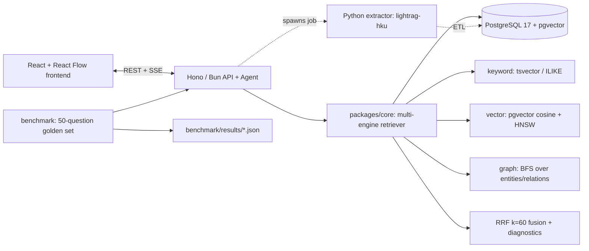

# GraphAtlas — Multi-Engine GraphRAG Enterprise Knowledge Platform

> Status: Day 1 in progress (scaffold). Detailed plan: [PLAN.md](./PLAN.md) ·
> [中文版](./PLAN-cn.md) · Linear ticket plan: [docs/LINEAR_PLAN.md](./docs/LINEAR_PLAN.md)

GraphAtlas ingests organizational documents (org chart, teams, projects, customers,
runbooks), builds a knowledge graph via LLM entity/relation extraction, and answers
questions through a hand-written multi-engine retriever that fuses keyword
(PostgreSQL tsvector/trigram), dense vector (pgvector), and graph traversal with
Reciprocal Rank Fusion — behind a typed Hono/TypeScript API and a React graph explorer.

## Architecture



## Quick start (Day 1 scaffold)

```bash
bun install
cp .env.example .env
# DB: `docker compose up -d` OR use local Homebrew postgresql@17 + pgvector
bun run dev:all
```

Open http://localhost:5173 (web) and http://localhost:3001/health (API).

## Monorepo layout

```txt
apps/api/        Hono + Bun API (documents, jobs, search, chat, graph, eval)
apps/web/        React + Vite + Tailwind frontend
packages/core/   retrieval primitives: keyword/vector/graph recall, RRF, mode router, BFS
packages/db/     PostgreSQL + pgvector migrations and query builders
packages/contracts/ shared types
extractor/       Python 3.11 + lightrag-hku graph extraction (Day 2)
data/            corpus + 50-question golden set (Day 1)
benchmark/       evaluation runner (Day 3)
```

## Honesty policy

Every number in this README (performance, accuracy) is measured by this repo's own
benchmark scripts and traced to `benchmark/results/*.json`. No preset figures.

## Measured results (2026-08-22, 50-question golden set)

Run: `bun benchmark --mode <mode> --limit 50` — full details in
[docs/BENCHMARK.md](./docs/BENCHMARK.md) and JSONs under `benchmark/results/`.

| Mode | Hit@5 | EntityRecall@10 | Faithfulness (1–5) | p95 (ms) |
|---|---|---|---|---|
| **hybrid (RRF)** | **0.840** | 0.688 | 4.38 | 537 |
| vector-only | 0.800 | 0.688 | 4.36 | 616 |
| graph-only | 0.240 | 0.684 | 2.44 | 10 |
| keyword-only | 0.000 | 0.000 | 1.26 | 27 |

> Multi-engine RRF fusion improved answer coverage (Hit@5) by **+4 pp over
> vector-only** on my 50-question benchmark (0.840 vs 0.800), while keeping graph
> evidence (EntityRecall@10 = 0.688). Numbers verified from
> `benchmark/results/2026-08-22-hybrid.json` etc.
