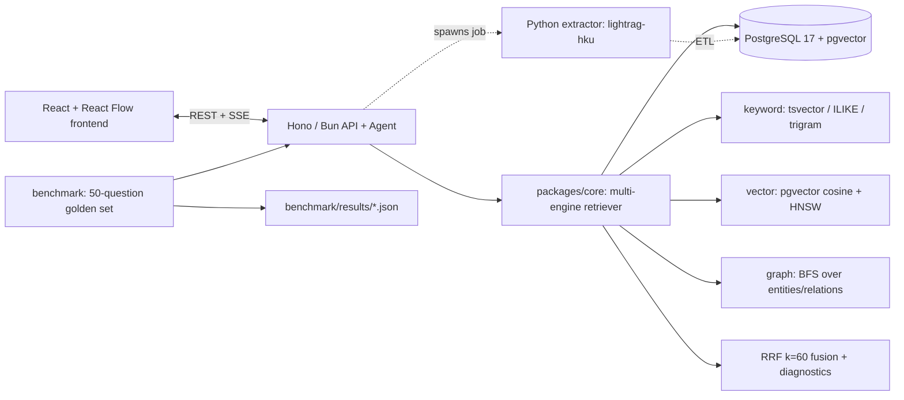

# GraphAtlas — Multi-Engine GraphRAG Enterprise Knowledge Platform

> Status: **functional end-to-end** (ingest → graph build → multi-engine retrieval →
> agent Q&A → benchmark). Plans: [PLAN.md](./PLAN.md) · [中文版](./PLAN-cn.md) ·
> API: [docs/API.md](./docs/API.md) · Benchmark: [docs/BENCHMARK.md](./docs/BENCHMARK.md) ·
> Provenance: [docs/SOURCES.md](./docs/SOURCES.md)

GraphAtlas ingests organizational documents (org chart, teams, projects, customers,
runbooks), builds a knowledge graph via LLM entity/relation extraction (LightRAG), and
answers questions through a **hand-written multi-engine retriever** that fuses keyword
(PostgreSQL `tsvector`/trigram), dense vector (pgvector), and graph traversal with
Reciprocal Rank Fusion — behind a typed Hono/TypeScript API (SSE streaming) and a
React graph explorer.

## Features

- **Ingestion pipeline** — upload md/txt/csv → LightRAG extraction (chunk → LLM
  entity/relation extraction → gleaning → merge) → ETL into a runtime PostgreSQL schema
  with per-stage timing and failure capture.
- **Multi-engine retrieval** — keyword (`tsvector` + ILIKE), dense vector (pgvector
  cosine + HNSW), and graph (cycle-safe BFS over relations) fused with RRF (K=60),
  per-path diagnostics, and a rule → LLM → default mode router (local/global/mix).
- **Tool-calling agent** — hand-written loop (no LangChain) with
  `search_hybrid` / `graph_neighbors` / `get_document` / `lookup_entity`, chunk-level
  citations, and a full trace; streamed over SSE.
- **Frontend** — dark-themed React app: upload/jobs, React Flow graph explorer
  (1-hop expand), streaming QA chat with evidence cards, benchmark dashboard.
- **Evaluation** — 50-question golden set, 4-mode ablation, LLM-judged Hit@1/5 and
  faithfulness; every number traces to `benchmark/results/*.json`.

## Architecture



## Quick start

Prereqs: Bun 1.x, Python 3.11, PostgreSQL 17 + pgvector (Homebrew or
`docker compose up -d`), and OpenAI-compatible LLM + embedding keys.

```bash
bun install
cp .env.example .env        # fill AGENT_* (LLM) + EMBEDDING_* (vector) keys
bun run db:init             # create graphatlas schema (migrations)
bun run dev:all             # API :3001 + web :5173
```

- Open http://localhost:5173 — upload a document, click **Ingest**, then explore the
  graph and ask questions in **Chat**.
- Ingest the bundled corpus: `bash scripts/seed-corpus.sh` (real LLM extraction).
- Run tests: `bun run test` (backend), `bun run test:web` (frontend),
  `bun run e2e` (Playwright + /search smoke), `bun benchmark --summary` (results).

## Tech stack & honesty map (every resume term → code)

| Claim | Where it lives |
|---|---|
| Hono + Bun/TypeScript API, SSE | `apps/api/src/` (`app.ts`, `routes/chat.ts`, `routes/search.ts`) |
| PostgreSQL 17 + pgvector (HNSW, cosine) | `packages/db/src/migrations/001_init.sql`, `002_...sql`; `packages/core/src/retrieval/vector.ts` |
| Keyword search (`tsvector`, `pg_trgm`) | `packages/db/src/migrations/001_init.sql`; `packages/core/src/retrieval/keyword.ts` |
| Knowledge graph build (LightRAG extraction) | `extractor/src/orgrag_extract/staging.py` |
| Graph traversal (BFS) | `packages/core/src/retrieval/bfs.ts`, `graph.ts` |
| Reciprocal Rank Fusion (K=60) | `packages/core/src/retrieval/rrf.ts` |
| Mode router (rule → LLM → mix) | `packages/core/src/retrieval/router.ts` |
| Tool-calling agent + trace | `apps/api/src/agent/` |
| ETL staging → runtime | `packages/db/src/etl/` |
| Benchmark harness (50 Q, LLM judge) | `benchmark/`, `data/eval/golden_questions.json` |
| React Flow graph explorer | `apps/web/src/pages/GraphExplorer.tsx`, `graph/transform.ts` |

## Monorepo layout

```txt
apps/api/        Hono + Bun API + agent (documents, jobs, search, chat, graph, eval)
apps/web/        React + Vite + Tailwind + React Flow frontend
packages/core/   retrieval primitives: keyword/vector/graph recall, RRF, router, BFS
packages/db/     PostgreSQL + pgvector migrations, connection, ETL, repos
packages/contracts/ shared types
extractor/       Python 3.11 + lightrag-hku graph extraction sidecar
data/            English corpus (Aurora Dynamics) + 50-question golden set
benchmark/       evaluation runner + measured results JSON
tests/           Playwright e2e (upload→graph, chat→citation)
docs/            API.md, BENCHMARK.md, SOURCES.md, LINEAR_PLAN.md
```

## Measured results (2026-08-22, 50-question golden set)

Run: `bun benchmark --mode <mode> --limit 50` — full details in
[docs/BENCHMARK.md](./docs/BENCHMARK.md) and JSONs under `benchmark/results/`.

| Mode | Hit@5 | EntityRecall@10 | Faithfulness (1–5) | p95 (ms) |
|---|---|---|---|---|
| **hybrid (RRF)** | **0.840** | 0.688 | 4.38 | 537 |
| vector-only | 0.800 | 0.688 | 4.36 | 616 |
| graph-only | 0.240 | 0.684 | 2.44 | 10 |
| keyword-only | 0.000 | 0.000 | 1.26 | 27 |

> Multi-engine RRF fusion improved answer coverage (Hit@5) by **+4 pp over
> vector-only** on my 50-question benchmark (0.840 vs 0.800), while keeping graph
> evidence (EntityRecall@10 = 0.688). Numbers verified from
> `benchmark/results/2026-08-22-hybrid.json` etc.

## Demo video

Four-part walkthrough (recorded 2026-08-22). QuickTime `.mov` — GitHub does not
inline-play `.mov`, so download to view, or open them locally.

| Part | File |
|---|---|
| 1 | [graphatlas-demo01.mov](./docs/demos/graphatlas-demo01.mov) |
| 2 | [graphatlas-demo02.mov](./docs/demos/graphatlas-demo02.mov) |
| 3 | [graphatlas-demo03.mov](./docs/demos/graphatlas-demo03.mov) |
| 4 | [graphatlas-demo04.mov](./docs/demos/graphatlas-demo04.mov) |

Covers: ingest → graph explorer → multi-engine QA with evidence → benchmark summary.
Recording script: [docs/DEMO_SCRIPT.md](./docs/DEMO_SCRIPT.md).

> Tip: for a single link that plays anywhere (GitHub/README/resume), upload the four
> parts to YouTube and I can swap these links for the playlist URL.

## Honesty policy

- Every number on the README/resume is measured by this repo's own benchmark and
  traces to `benchmark/results/*.json` — no preset figures.
- Technical claims map 1:1 to code (see the honesty map above) and to the course
  materials/industry sources listed in [docs/SOURCES.md](./docs/SOURCES.md).

## License

[MIT](./LICENSE)
